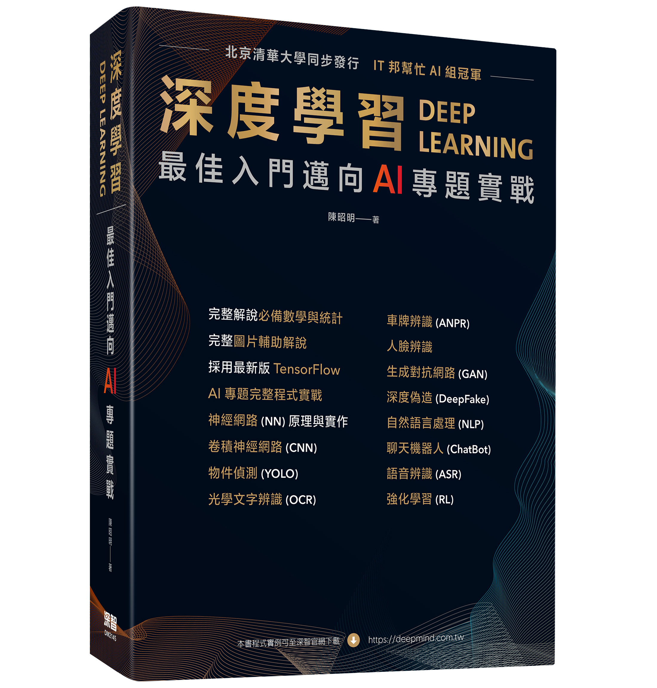

# 深度學習 最佳入門邁向AI專題實戰 第二版

### 範例程式：src 資料夾
### 各章參考資料：參考資料.pdf

#### 第一章介紹AI的發展趨勢，鑑古知今，瞭解前兩波AI失敗的原因，比較第三波發展的差異性。
#### 第二章介紹深度學習必備的統計/數學基礎，不僅要理解相關知識，也力求能撰寫程式解題。
#### 第三章介紹TensorFlow/Keras基本功能，包括張量(Tensor)運算、自動微分及神經網路模型的組成，並說明梯度下降法求解的過程。
#### 第四章開始實作，依照機器學習10項流程，撰寫完整的範例，包括Web、桌面程式。
#### 第五章介紹TensorFlow進階功能，包括各種工具，如TensorBoard、TensorFlow Serving、Callbacks。
#### 第六~八章介紹圖像/視訊的演算法及各式應用。
#### 第九~十一章介紹生成式AI，包括Encoder-decoder、生成對抗網路(GAN)及擴散模型(Diffusion Model)，也說明Stable Diffusion及Dalle-E實作。
#### 第十二章介紹各種影像應用，包括臉部辨識、OCR、車牌辨識及圖像去背。
#### 第十三~十四章介紹自然語言處理及各式應用。
#### 第十五章介紹大型語言模型(Large Language Model, LLM)，包括Transformer演算法、ChatGPT實作及企業導入實務。
#### 第十六章介紹語音辨識的原理/演算法/實作/應用，包括OpenAI Whisper實作及應用範例。
#### 第十七章介紹強化學習(Reinforcement Learning, RL)的概念/演算法/實作/應用，包括Gymnasium、Stable Baselines3套件實作及應用範例。

